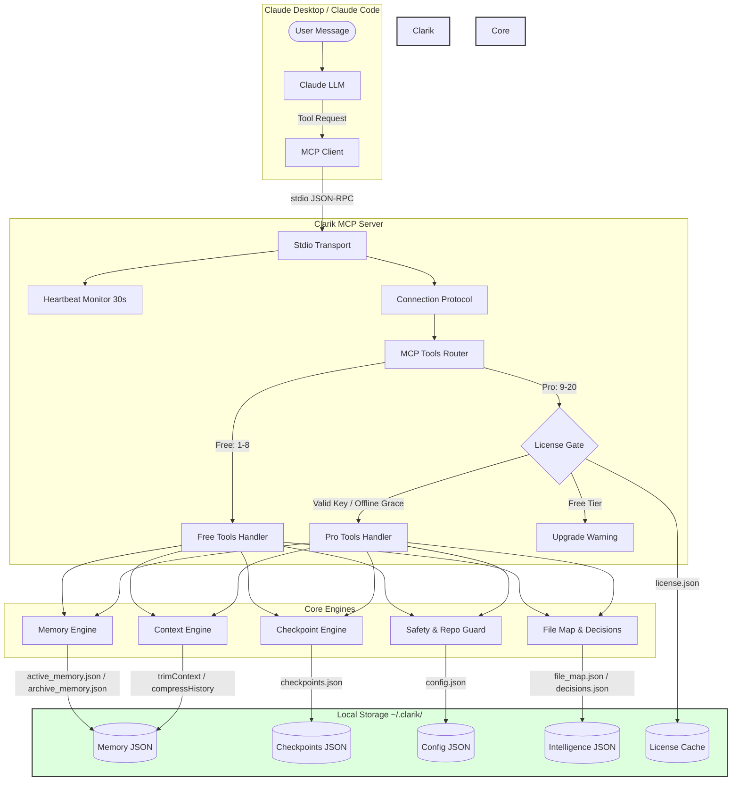

# Clarik — Technical & Architectural Blueprint

This document serves as the master source of truth for the **Clarik** MCP server. It details the system architecture, directory structures, core engines, API schemas, security/licensing caches, safety mechanisms, and development guidelines.

---

## 1. System Architecture & Flow

Clarik functions as a local **Model Context Protocol (MCP)** server communicating over a standard Input/Output (`stdio`) stream. It interfaces directly with **Claude Desktop** and **Claude Code** to inject persistence, intelligent context, safety guards, and session checkpointing locally.



---

## 2. Directory & Module Guide

The project is structured logically around self-contained modules under `src/`, exposing clean functional APIs to the server entry point.

```
clarik/
├── CLARIK_PLAN.md               ← Master build specification
├── README.md                    ← Product documentation & quickstart
├── ARCHITECTURE.md              ← This document
├── cli.ts                       ← CLI entry point (install, activate, status, upgrade, uninstall)
├── install.ts                   ← Setup wizard for Claude Desktop + Claude Code
├── tsconfig.json                ← TypeScript compilation configuration
├── package.json                 ← Dependencies & scripts configuration
├── src/
│   ├── index.ts                 ← MCP Server Entry Point (registers tools, resources, prompts)
│   ├── storage.ts               ← Atomic File I/O, backup recovery, hashing, paths
│   ├── types.ts                 ← Unified TypeScript interfaces and tool classifications
│   │
│   ├── memory/                  ← CORE 1: Memory Management
│   │   ├── learn.ts             ← Strips thinking blocks, extracts facts based on rules
│   │   ├── recall.ts            ← Score-based semantic fact retrieval
│   │   ├── conflict.ts          ← Keyword overlap detection & pairwise resolution
│   │   ├── archive.ts           ← Offloads stale memories to keep active storage fast
│   │   └── project.ts           ← Scope isolation hashing Git URL / Git Root / CWD
│   │
│   ├── context/                 ← CORE 2: Context Optimization
│   │   ├── trim.ts              ← Packs top memories & file map within budget
│   │   ├── compress.ts          ← General discussion summarizer, preserving decisions
│   │   └── tokens.ts            ← Anthropic-native token estimator
│   │
│   ├── checkpoint/              ← CORE 3: Continuity
│   │   ├── save.ts              ← Structured checkpoint generator & 20-cap pruning
│   │   └── resume.ts            ← Loads, formats, and injects session checkpoints
│   │
│   ├── license/                 ← CORE 4: Licensing
│   │   ├── validate.ts          ← Gumroad online verify & signature verification
│   │   └── grace.ts             ← Offline grace period (5-day countdown tracker)
│   │
│   ├── safety/                  ← CORE 4: Safety
│   │   ├── modes.ts             ← Configurations for Safe, Strict, Minimal, Creative modes
│   │   └── repo_guard.ts        ← Confirmation flows for protected files (.env, migrations)
│   │
│   ├── intelligence/            ← The Moat: Intelligence Layer
│   │   ├── file_map.ts          ← File-to-purpose index mapper
│   │   └── decision_timeline.ts ← Architectural decision log tracker
│   │
│   └── compat/                  ← Compatibility & Heartbeat Layers
│       ├── transport.ts         ← Stdio transport wrapper & 30s active heartbeat ping
│       ├── platform.ts          ← OS-aware Claude path finder & Windows cmd wrapper
│       └── protocol.ts          ← Connection Protocol factory (preventing instance reuse)
└── dist/                        ← Compiled JavaScript output (built via tsc)
```

---

## 3. Core Systems Deep-Dive

### 🧠 Core 1 — Memory Engine
The Memory system extracts and injects facts locally to bridge context boundaries. 

* **Thinking Sanitization**: All content is sanitized through `stripThinkingBlocks` before extraction. Any `<thinking>` or `<antml-thinking>` blocks and their contents are discarded, preventing speculative thinking-trace assumptions from leaking into memory.
* **Extraction Heuristics**: Evaluated by prioritized regex lists mapping framework tags, decision statements, gotchas, file mappings, and architectural patterns.
* **Recall Scoring Formula**:
  Each fact is evaluated dynamically against incoming queries using a composite scoring mechanism:
  $$\text{Score} = (\text{Relevance} \times 0.5) + (\text{Recency} \times 0.3) + (\text{Importance} \times 0.2)$$
  * *Relevance*: Keyword overlap (partial matches evaluated at 50% value) boosted by category keywords matching the query intent.
  * *Recency*: Exponential decay formula $e^{-\text{days} / 30}$ measuring how recently a memory was referenced.
  * *Importance*: Normalize reference count against maximum project reference thresholds.
* **Conflict Resolution**:
  Compares facts pairwise. If keyword overlap crosses Jaccard-like thresholds:
  1. *Decisions*: New decisions always supersede old ones, automatically deprecating the older fact.
  2. *General Facts*: If the new fact has high confidence ($>0.7$) and the existing fact is $>30$ days old, the old fact is deprecated.
  3. *Ambiguous*: Both facts are marked `conflicting` and surfaced to the user.

### 📄 Core 2 — Context Engine
Maintains a lean, optimized prompt payload for Claude.

* **Token Budgets**: Formally allocated out of a default 100K token budget:
  * System Memory: 4,000 tokens (highly ranked memories)
  * File Map: 1,000 tokens (relevant indexes)
  * Current Message: 2,000 tokens
  * Recent History: 20,000 tokens (last 5 messages kept verbatim)
  * Ranked History: 15,000 tokens (prior discussion summarized)
  * File Context: 50,000 tokens
  * Safety Buffer: 8,000 tokens
* **History Compression**: Summarizes general chat turns older than a threshold but preserves key sentences containing *Preserve Signals* (e.g., `decided to`, `fixed by`, `looks good`, `requirement:`) verbatim.

### 🔄 Core 3 — Checkpoint Engine
Enables absolute session continuity. When Claude's context fills up, the checkpoint engine serializes the complete working state:
* Working Goal
* Finished tasks checklist
* Key technical decisions
* Open questions requiring feedback
* File names currently open
* Context usage metrics
A fresh chat session starts by invoking `clarik_checkpoint_resume`, loading this formatted structure to restore Claude's working context immediately.

### 🔒 Core 4 — License & Safety Engine

#### Cryptographic License Caching
Clarik does **not** store easily tampered booleans like `{"valid": true}`. The validation flow enforces security:
1. Online check registers the raw license payload against the Gumroad endpoint.
2. The raw response is written locally, alongside a cryptographic SHA-256 signature hash of the exact response (`responseHash`).
3. Local lookups run `sha256(signedResponse)` and assert it matches the stored `responseHash`. Any manual modifications invalidate the cache.
4. Active cache expires every 24 hours, initiating a silent background fetch or falling back to the offline grace counter.

```
[Local Check] ──> Read Cache ──> sha256(signedResponse) == responseHash ?
                                      │                        │
                                  [Yes / Match]           [No / Altered]
                                      │                        │
                              Valid Until Check?          Block access
                                  │          │
                            [Still 24h]    [Expired]
                                  │          │
                             Allow Pro    Online Verify Failed?
                                             │             │
                                           [No]          [Yes]
                                             │             │
                                         Update Cache  Grace Period Expiry Check
```

#### Safe Modes & Repo Guard
Four modes control execution safety boundaries:
* **Safe** (Default): Memory and checkpoints active, repo guard enforces checks.
* **Strict**: Enforces absolute file guards, flags unverified assumptions.
* **Minimal**: Maximum privacy. Memory writing deactivated, only basic context trimming active.
* **Creative**: Guards relaxed, maximum flexibility.

**Repo Guard Interceptor**: Intercepts paths matching protected expressions (`migrations/`, `.env*`, `*secrets*`, `.github/workflows/`, and `production.*` configurations). Returns a warning requiring user authorization instead of blocking command execution outright.

---

## 4. Local Storage Schema

All configurations and data stores are kept locally in `~/.clarik/` (resolved via `os.homedir()`).

### `~/.clarik/config.json`
Stores global preferences and installer metadata.
```json
{
  "disclaimerShown": true,
  "mode": "safe",
  "projectId": "a3f5c9e2b1d0",
  "version": "0.1.0",
  "installedAt": "2026-05-29T00:42:38.123Z"
}
```

### `~/.clarik/projects/{projectId}/active_memory.json`
Stores the active project memories (capped at 200).
```json
{
  "version": 1,
  "projectId": "a3f5c9e2b1d0",
  "facts": [
    {
      "id": "mem_20260529_abc12345",
      "category": "project",
      "fact": "Project is built with Next.js 14 App Router and TypeScript",
      "confidence": 0.85,
      "timesReferenced": 4,
      "createdAt": "2026-05-29T00:42:38.123Z",
      "lastUsed": "2026-05-29T00:53:11.456Z",
      "status": "active",
      "projectId": "a3f5c9e2b1d0",
      "source": "assistant_final",
      "tags": ["project", "next.js", "typescript"]
    }
  ],
  "lastUpdated": "2026-05-29T00:53:11.456Z"
}
```

### `~/.clarik/projects/{projectId}/file_map.json`
Maps files to details, giving Claude structural context.
```json
{
  "version": 1,
  "projectId": "a3f5c9e2b1d0",
  "mappings": [
    {
      "filePath": "src/storage.ts",
      "purpose": "Atomic File I/O operations and path resolution helpers",
      "lastUpdated": "2026-05-29T00:42:38.123Z"
    }
  ]
}
```

---

## 5. Development & Troubleshooting

### Building the Project
Clarik is written in TypeScript and compiled into ES Modules.
```bash
# 1. Install dependencies
npm install

# 2. Build the project (compiles into dist/)
npm run build

# 3. Compile and watch for active file changes
npm run dev
```

### Local Testing & Troubleshooting
Because Clarik communicates over standard I/O:
* ⚠️ **Do not use `console.log`** in server code, as it corrupts the JSON-RPC communication stream. Use `console.error` for developer logging, as it prints directly to Claude's debug channel.
* To check if the server starts and responds locally, you can spin up the transport runner:
  ```bash
  node dist/src/index.js
  ```
  *(Press `Ctrl+C` to terminate).*
* Stdio logs for Claude Desktop are written to:
  * **Mac**: `~/Library/Logs/Claude/mcp-server-clarik.log`
  * **Windows**: `%APPDATA%\Claude\logs\mcp-server-clarik.log`
